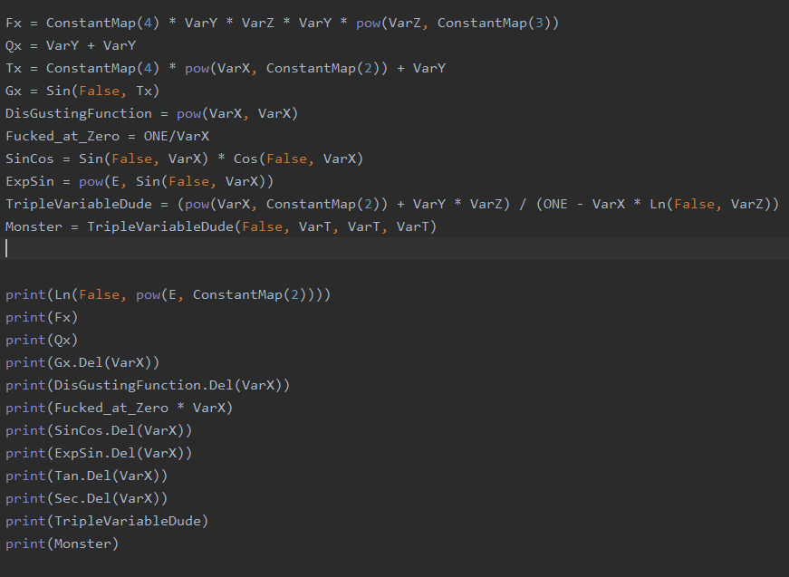
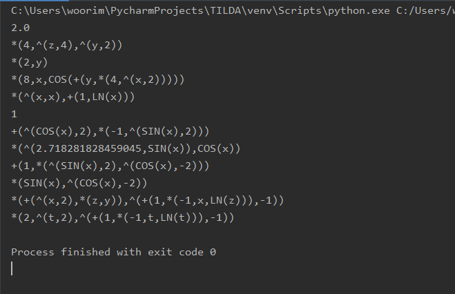

# SomethingLikeCAS

Simple Computer Algebra System.

 

## Description

system on real - valued single or multi variable functions. Primary goal of this project is
clearly to do Analysis and Algebra.

 

## Design Philosophy

Everything is a function.

Isomorphisms are better than inheritance.

Mathematically Equal things are equal.

Equivalent things are equal in some contexts.

The only we know is Identity map.

 

## TODOLISTS

**Mathematics**

 [] Equation Solver
 [] Matrix Algebra
 [] Extending Polynomial Module
 [] Series Computation
 [] Numerical Methods
 
 Challenging Topics might be:
 
 [] Symbolic Integration
 [] Geometries
 
 **Development**
 
 [] Parser
 [] Dialogue Interpretation
 [] Prettier I/O
 
 Challenging Topics might be:
 
 [] Graph Rendering 

 

## Schedule 

의미가 있을진 잘 모르겠고, 2020/12월까지 천천히 만들어서 Challenging Topics를 제외하고 구현하는 것이 목표다. 또한 Challenging Topics를
다루기 위한 준비를 해놓는 것 정도?

 

## Principles

See [Principles](./imgs/Principles.md)

 

## Progress

아래는 몇 가지 테스트 내역이다.

그리고 그 결과이다.

